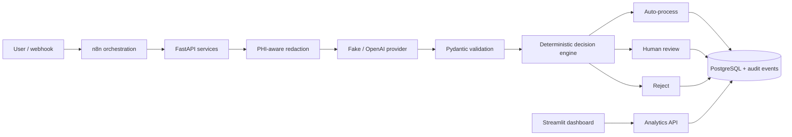
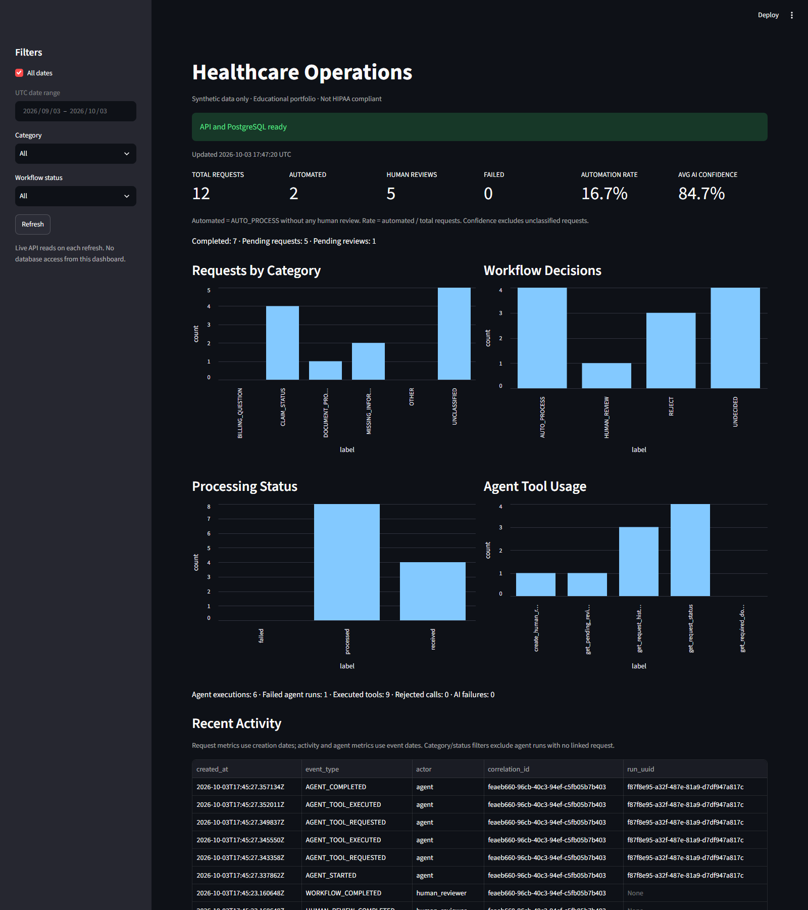
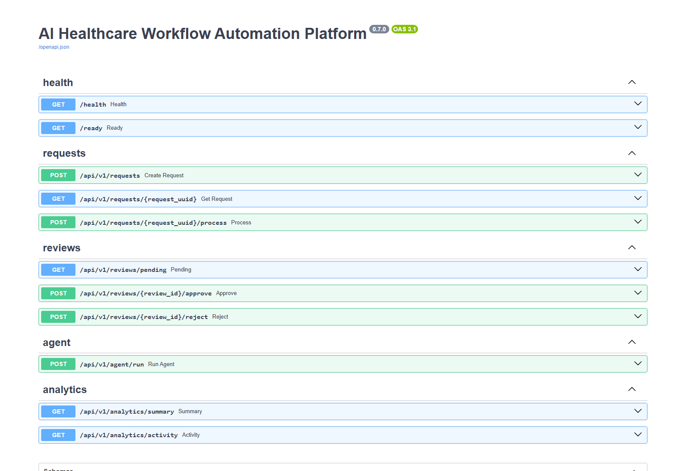

# AI Healthcare Workflow Automation Platform

**A portfolio project for workflow automation, API integration and controlled AI operations.**

Turn a synthetic administrative healthcare request into a validated, auditable workflow: classify it, apply deterministic rules, escalate uncertain work to a human, and monitor the outcome.

> This is a portfolio/educational project using synthetic healthcare data. It demonstrates security-conscious and HIPAA-aware design principles but is not a claim of HIPAA compliance.

[Architecture](docs/architecture.md) ? [Security review](docs/security.md) ? [Agent design](docs/agent-design.md) ? [n8n workflows](docs/n8n-workflows.md) ? [Five-minute demo](docs/demo.md)

## Business Problem

Administrative healthcare requests arrive with inconsistent information, unclear intent and uncertain routing. Manual handoffs make it difficult to explain why a request was automated, held for review or rejected, and to track the work across systems.

This project models those operational challenges with synthetic data. It does not claim measured cost savings or real patient outcomes.

## Solution

The platform combines n8n orchestration, a transactional FastAPI backend, validated AI recommendations, human review and aggregate monitoring. The LLM recommends; application policy decides. Important state changes produce audit events, and opaque correlation IDs connect operations across services.

An offline fake provider makes the complete demo reproducible without paid API access. A real OpenAI adapter is available behind the same abstraction.

## Architecture



API routes stay thin. Services own business logic, SQLAlchemy owns persistence, Alembic owns schema changes, and provider code stays isolated. The dashboard never connects directly to PostgreSQL. [Component and transaction details ?](docs/architecture.md)

## Technology Stack

| Layer | Technologies |
| --- | --- |
| API and contracts | Python 3.11+, FastAPI, Pydantic |
| Persistence | PostgreSQL 17, SQLAlchemy 2.x, psycopg, Alembic |
| Orchestration | n8n, JSON webhooks, REST APIs |
| AI | OpenAI Responses API adapter, structured output, deterministic fake providers |
| Operations | Streamlit, analytics endpoints, structured JSON logs, correlation IDs |
| Infrastructure | Docker, Docker Compose; Python 3.13 container images |
| Verification | pytest, real PostgreSQL test schemas, HTTP mocks, Node workflow tests |

## n8n Workflow Automation

Three portable workflows are included:

| Workflow | Responsibility |
| --- | --- |
| [Healthcare Request Intake](n8n/workflows/01_request_intake.json) | Create-only intake and validation response |
| [Healthcare Request Automation](n8n/workflows/01_healthcare_request_automation.json) | Create ? process ? decision branch ? response |
| [Healthcare Agent Operations](n8n/workflows/02_agent_operations.json) | Run controlled agent ? escalation/result branch ? response |

FastAPI owns validation, decisions, reviews and storage. n8n handles transport, routing and safe errors. HTTP timeouts are bounded and mutation retries are disabled. Exports contain no secrets or pinned execution data. [Import, publish and test ?](docs/n8n-workflows.md)

## AI Classification

`AIProvider` separates the application from the external model. `RequestClassifier` validates every response against an exact Pydantic contract:

```json
{
  "category": "CLAIM_STATUS",
  "confidence": 0.60,
  "recommended_action": "AUTO_PROCESS",
  "reason": "Synthetic offline classification."
}
```

Categories are CLAIM_STATUS, MISSING_INFORMATION, BILLING_QUESTION, DOCUMENT_PROCESSING and OTHER. Invalid enums, extra fields, malformed JSON, nonfinite confidence, refusal and provider failure cannot bypass deterministic handling. Free-text model reasons are discarded after validation; persisted decision reasons are controlled service messages.

## PHI-Aware Processing

Common patient/claim identifiers, DOB formats, email addresses and phone numbers are replaced before provider calls:

```text
Patient PAT-12345 DOB 1995-10-02 asks about claim CLM-9999.
Patient [PATIENT_ID] DOB [DOB] asks about claim [CLAIM_ID].
```

This is rule-based redaction, not comprehensive de-identification. Names, addresses and unsupported formats can remain. Original synthetic input is stored in the request record; analytics/logs exclude it. Use fake data with both providers.

## Deterministic Decision Engine

| Rule | Outcome |
| --- | --- |
| Confidence < 0.85 | HUMAN_REVIEW |
| OTHER category, invalid output or provider failure | HUMAN_REVIEW |
| Validated HUMAN_REVIEW recommendation | HUMAN_REVIEW |
| Missing information or billing question | HUMAN_REVIEW |
| REJECT outside document processing | HUMAN_REVIEW |
| Remaining permitted high-confidence administrative cases | Validated recommendation |

AUTO_PROCESS and REJECT are recorded workflow dispositions. They do not pay/deny insurance claims, deny treatment or make clinical decisions. The demo deliberately shows confidence overriding an AUTO_PROCESS recommendation.

## Human-in-the-Loop

Pending reviews are stored separately with original AI recommendation, reviewer outcome/notes and timestamps. Humans explicitly approve or reject through the API. Row locks and database constraints prevent duplicate resolution; updates and completion audits commit together.

`processed` means the pipeline finished, including when human review remains pending. Use `system_decision` to understand the current disposition. Human-approved work never counts as automated in the dashboard.

## Autonomous Agent

The HealthcareOperationsAgent uses limited autonomy to select approved administrative tools. It produces one bounded intent/tool plan, validates the entire plan before execution, and returns structured committed results. There is no infinite planning loop or model-written executable code.


## Agent Tools & Safety

- `get_request_status(request_uuid)`
- `get_request_history(request_uuid)`
- `get_required_documents(category)`
- `create_human_review(request_uuid, reason)`
- `get_pending_review_count()`

Every tool validates a Pydantic input schema. Request-specific calls must match the server-established UUID scope. Unknown tools and future high-impact effects are denied. Only read operations and human escalation are allowed; the agent cannot approve/reject reviews. Defaults limit execution to five tool attempts and a 25-second deadline.

The planner has no database handle, credentials, shell, filesystem, arbitrary HTTP or SQL access. Trusted backend functions implement tool behavior. UUID scope is a capability restriction, **not user authentication or tenant ownership enforcement**. [Agent boundaries and fallback ?](docs/agent-design.md)

## Operations Dashboard

Streamlit displays six KPI cards: Total Requests, Automated, Human Reviews, Failed, Automation Rate and Average AI Confidence. Category, decision, status and agent-tool charts accompany a bounded recent activity table. Filters cover UTC date range, category and processing status.

The dashboard calls FastAPI only. It receives no request text, patient references or reviewer notes. Automation rate is automatic completions without any review divided by total filtered requests. [All metric definitions ?](docs/operations-dashboard.md)

## Auditability

Audit events cover receipt, redaction, classification, deterministic decisions, human review and agent lifecycle/tool execution. Metadata contains controlled enums, counts, reason codes and opaque identifiers?not prompts or model reasoning.

X-Correlation-ID connects HTTP responses, structured application logs and audit records. Agent run UUIDs group global and request-specific operations. Creation, processing and review updates use transactional audits. These records are not tamper-proof, and a database outage can prevent failure-audit writes.

## Error Handling

Provider errors and invalid AI output escalate safely. Duplicate processing returns the persisted result or 409 while already running. Completed reviews reject further decisions with 409. Unknown IDs return 404; invalid schemas return 422; database failures use generic responses.

Only safe dashboard GETs retry transient failures, at most three attempts. n8n mutation calls, provider calls and agent runs do not retry automatically. Timeout responses do not pretend a lost write never happened. [Operational behavior ?](docs/operations-dashboard.md#reliability-and-tracing)

## Security Design

The final review added streamed request-body limits, JSON-only writes, browser-origin/host checks and explicit n8n command/file-node exclusions. Secrets remain in environment variables; `.env` is ignored and excluded from image builds. Application images run non-root, DB ports are internal by default, and published services bind to loopback.

Structured logs suppress bodies, credentials, SQL parameters and exception details. Tests exercise injection, scope, validation, privacy and concurrency boundaries. CORS is not permissive. Webhooks and healthcare APIs remain unauthenticated local-demo interfaces; do not expose them publicly. [Findings, fixes and residual risks ?](docs/security.md)

## Running Locally

Prerequisites: Git, Docker Desktop/Engine with Linux containers and Docker Compose v2. Python 3.11+ is needed only for host tests/demo scripts.

```powershell
git clone https://github.com/omarsharyr/healthcare-ai-automation.git
cd healthcare-ai-automation
# First setup only; preserve an existing .env.
if (-not (Test-Path .env)) { Copy-Item .env.example .env }
```

Edit `.env`: set your local `POSTGRES_PASSWORD` and a generated stable `N8N_ENCRYPTION_KEY`. Keep `AI_PROVIDER=fake` for the free deterministic demo. Do not commit `.env` or change an existing volume's credentials casually. To generate a local value, run `python -c "import secrets; print(secrets.token_hex(32))"` and save it only in `.env`.

```powershell
docker compose config --quiet
docker compose up -d --build --wait --wait-timeout 240
docker compose ps -a
```

| Service | Local URL |
| --- | --- |
| FastAPI / Swagger | http://localhost:8000 / http://localhost:8000/docs |
| Liveness / readiness | http://localhost:8000/health / http://localhost:8000/ready |
| n8n | http://localhost:5678 |
| Streamlit | http://localhost:8501 |
| PostgreSQL | Internal `postgres:5432` |

`migrate` should show Exited (0); application services should become healthy. Import and publish the n8n exports using [these commands](docs/n8n-workflows.md#import-and-publish). An imported inactive workflow does not serve its production webhook.

The optional `docker-compose.host-db.yml` override publishes PostgreSQL on loopback for host Python/legacy verification scripts. Named volumes preserve PostgreSQL and n8n data; **`docker compose down -v` deletes both**. On macOS/Linux, use `cp`, `python3`, `.venv/bin/python` and `cat file | docker compose exec -T n8n node` equivalents.

For optional real LLM use, set `AI_PROVIDER=openai` and `OPENAI_API_KEY` in ignored `.env`, then recreate the backend. Redaction is incomplete; still use synthetic data. Automated tests never need a real key.

## Testing

```powershell
python -m venv .venv
.\.venv\Scripts\python.exe -m pip install -r backend/requirements.txt
docker compose --profile test up -d --wait postgres-test
.\.venv\Scripts\python.exe -m pytest -c backend/pytest.ini backend/tests
.\.venv\Scripts\python.exe scripts/security_check.py
docker compose --profile test stop postgres-test
```

The suite covers FastAPI, real PostgreSQL/Alembic, redaction, classification, rules, reviews, agents/tools, audits, analytics and security boundaries. Each DB test uses a temporary schema in a separate test database. Fake providers and HTTP mocks are mandatory; real HTTP transports are blocked during pytest. Run [all n8n JavaScript checks](docs/n8n-workflows.md#demo-and-tests) as well.

## Demo

With the stack running and workflows published:

```powershell
.\.venv\Scripts\python.exe scripts/demo.py
# Optional rejection path with a fresh synthetic request:
.\.venv\Scripts\python.exe scripts/demo.py --decision reject
```

This verifies webhook intake ? persistence ? redaction ? fake classification at 0.60 confidence ? human review ? explicit resolution ? agent status/history ? correlated audits ? updated metrics. It refuses real-provider mode and leaves synthetic records for inspection. [Full presentation script and manual commands ?](docs/demo.md)

## Screenshots

Actual local synthetic-data captures:





Open the workflow exports in n8n to inspect the visual orchestration. Screenshots illustrate the local demo, not production activity or real healthcare data.

## What I Designed & Implemented

- Separated orchestration, API contracts, domain services, provider adapters and persistence.
- Implemented transactional request/review workflows and Alembic-managed schema evolution.
- Built structured AI classification with deterministic overrides and human escalation.
- Designed a capability-limited operations agent with scoped tools, budgets and audited execution.
- Added aggregate monitoring, correlation tracing and a dashboard isolated from the database.
- Created synthetic fixtures, reproducible demos and tests for failures, concurrency and security boundaries.

## Limitations

- Synthetic-only educational system; no HIPAA compliance claim or real healthcare deployment approval.
- No authentication, RBAC, tenant isolation, signed webhooks or verified reviewer identity.
- Regex redaction is incomplete; AI confidence is not calibrated accuracy.
- Synchronous processing, no queue/backpressure, no intake idempotency key or automatic recovery of failed requests.
- Mutable audits; no production retention, backup, encryption-at-rest or incident-response guarantees.
- n8n may temporarily persist execution payloads; disabled saving is not secure erasure.
- A real provider adapter exists, but paid model behavior is not exercised by automated verification.

## Future Improvements

Authenticated roles and tenant ownership, signed webhooks, durable task queues and idempotency, calibrated evaluation datasets, stronger redaction, least-privilege DB roles, managed secrets, retention controls, tamper-resistant audit storage, rate limiting and CI dependency scanning. These are future directions, not implemented claims.
