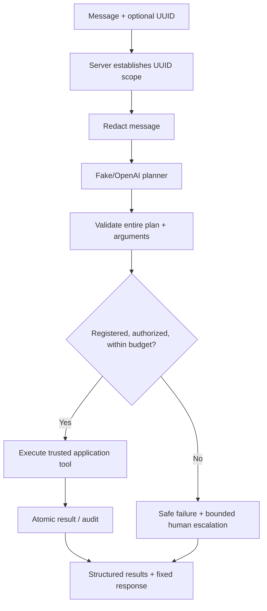

# Controlled agent design

The HealthcareOperationsAgent demonstrates limited autonomy for synthetic administrative operations. It uses one finite intent/tool plan, not an unbounded conversation or general-purpose execution environment.

## Capability contract

| Tool | Policy | Result |
| --- | --- | --- |
| `get_request_status(request_uuid)` | Read; exact UUID scope | Processing status/category/final decision |
| `get_request_history(request_uuid)` | Read; exact UUID scope | Up to 50 recent audit event names |
| `get_required_documents(category)` | Read; enum validation | Explicitly synthetic document checklist |
| `create_human_review(request_uuid, reason)` | Escalation only; exact UUID scope | New/reused pending review; cannot reopen a completed review |
| `get_pending_review_count()` | Read; server capability toggle | Aggregate pending count |

Every tool has a Pydantic input and structured output. Unknown fields/names fail closed. The registry does not evaluate Python, dynamically import functions, execute shell commands, accept SQL or arbitrary URLs, or expose credentials. Future write effects are denied until an explicit approval flow exists. The model cannot approve/reject a review.

## Reasoning and truthfulness

The model returns an intent and proposed calls. No hidden reasoning or free-form model answer is stored in audits. The server preflights the full plan before any tool runs, dispatches through a fixed allowlist, and constructs the response from committed tool results. An LLM statement cannot count as evidence that a tool executed.

## Budgets and failure

Defaults are five tool attempts and a 25-second execution deadline; environment ranges are bounded. There is one planner call and no recursive replanning. The async provider is canceled on timeout; DB queries use remaining-budget statement limits. No detached executor continues writing after the response. Connection acquisition/cleanup/audit writes can add bounded DB wait time, so this is not a strict HTTP wall-clock guarantee.

Fallback can create a review only within remaining time/call budget and the same UUID scope. `escalated=true` requires an actual pending review result. `human_action_required=true` with `escalated=false` means a human must investigate because escalation could not be completed. Earlier committed tools remain in the response if a later operation fails.

## Identity limitations

Scope is derived from explicit request UUID or exactly one UUID in the message. It limits the model within a run; it does not prove caller ownership. No authentication/RBAC exists. Backend Python implements trusted SQLAlchemy tools using application DB credentials, while the planner has no DB handle. This is a capability boundary, not a separate OS sandbox. Use localhost and synthetic data only.

Agent audits record STARTED, TOOL_REQUESTED, TOOL_EXECUTED, TOOL_REJECTED, FAILED and COMPLETED with run UUIDs and controlled metadata. See [the detailed agent guide](controlled-agent.md) for transaction behavior, configuration and API examples, and [the final demo](demo.md) for the supported presentation sequence.
