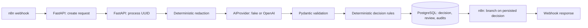

# Phase 5: AI processing and human review

Synthetic data only. This educational application is not HIPAA compliant. Regex redaction is incomplete and is not de-identification. There is no application authentication or verified reviewer identity. Keep the API and webhooks local.

## Architecture



Routes delegate to services. The provider receives only redacted text, with no database handle or request object. The original synthetic text remains in PostgreSQL and is available through the existing request GET endpoint. Redaction covers common patient/claim identifiers, DOB formats, email addresses and phone numbers; it can miss unsupported formats and over-redact other dates. Redacted text is not stored in an additional column.

`OpenAIProvider` calls the Responses API using a strict JSON schema, `store: false`, an environment API key, and a configurable HTTP timeout. It does not retry. Refusals, incomplete output, invalid JSON, missing/extra fields, unknown enums, nonfinite or out-of-range confidence, and provider errors cannot become automatic decisions. Pydantic independently validates the output. The model's free-text reason is validated but discarded: persisted decision reasons are fixed service messages, reducing accidental disclosure. The real provider follows the official [Structured Outputs guide](https://developers.openai.com/api/docs/guides/structured-outputs) and [Responses API guide](https://developers.openai.com/api/docs/guides/migrate-to-responses). `store: false` is not a promise of zero provider retention or compliance.

## Decision rules

Rules run in order; the LLM recommendation cannot bypass them.

| Condition | System decision |
| --- | --- |
| Provider failure or invalid AI output | HUMAN_REVIEW |
| Confidence below 0.85 | HUMAN_REVIEW |
| Category OTHER | HUMAN_REVIEW |
| Validated recommendation HUMAN_REVIEW | HUMAN_REVIEW |
| MISSING_INFORMATION or BILLING_QUESTION | HUMAN_REVIEW |
| REJECT recommendation outside DOCUMENT_PROCESSING | HUMAN_REVIEW |
| Remaining CLAIM_STATUS/DOCUMENT_PROCESSING at confidence >= 0.85 | Validated recommendation |

AUTO_PROCESS and REJECT only record administrative workflow dispositions. They do not pay/deny claims, make clinical decisions, or execute downstream actions. The n8n Complete/Review Queue/Reject nodes display the backend result; FastAPI already created any required review.

## Persistence and concurrency

Migration `0003` adds confidence, AI recommendation, system decision and decision reason to requests, expands processing status, and creates `human_reviews`. Each request can have at most one review. Database constraints enforce review state and enum values.

Processing holds a request row lock during the synchronous provider call, then commits the decision, optional review, and audit events atomically. This simple implementation occupies a DB connection while awaiting the provider; it is not a background queue. Simultaneous processing returns 409; repeated processing after success returns the existing result without another provider call or audit sequence. HTTPX timeouts apply to network operations, not a strict total wall-clock deadline.

`received` means ready for processing; `processed` means the classification/decision pipeline finished, including when human review is still pending. `failed` means an unexpected internal processing failure requires investigation. Provider failures intentionally result in `processed` + HUMAN_REVIEW instead of `failed`.

Approving/rejecting locks the review and request and commits their updates with both completion audits. Approval sets final system decision AUTO_PROCESS; rejection sets REJECT. The original AI recommendation remains unchanged. A completed review returns 409 on further decisions. Optional reviewer notes are stored only in the review row and returned in review responses; never submit real healthcare data in notes.

An unexpected processing error rolls back the processing transaction, then attempts a separate safe WORKFLOW_FAILED audit and failed status. If PostgreSQL is unavailable, that audit cannot be guaranteed. No automatic failed-state reset is provided. Migration downgrade refuses when processed/failed requests exist rather than silently discarding their processing history; downgrade/upgrade tests use isolated schemas.

Audit metadata contains only controlled enums, numeric identifiers, counts and failure codes. Events are REQUEST_RECEIVED, PHI_REDACTION_COMPLETED, AI_CLASSIFICATION_STARTED, AI_CLASSIFICATION_COMPLETED or AI_CLASSIFICATION_FAILED, WORKFLOW_DECISION_MADE, HUMAN_REVIEW_REQUESTED, HUMAN_REVIEW_COMPLETED, WORKFLOW_COMPLETED, and WORKFLOW_FAILED. Start/completion events are committed together, not live progress records. Actor `human_reviewer` is a label, not authenticated identity. Audits are not tamper-proof.

## Configure and start

Preserve your existing `.env`, database password, and n8n encryption key. Add the Phase 5 settings from `.env.example`:

```dotenv
APP_VERSION=0.5.0
AI_PROVIDER=fake
OPENAI_API_KEY=
OPENAI_MODEL=gpt-4.1-mini
AI_TIMEOUT_SECONDS=20
```

`fake` is the offline demo default. For an optional real classification, set `AI_PROVIDER=openai` and your own `OPENAI_API_KEY` only in ignored `.env`; select a model supporting strict structured output. Timeout must be 1–30 seconds. Recreate the backend after changes. Missing keys or provider errors lead to human review, never a silent fake result. Only the backend receives the LLM key.

```powershell
docker compose config --quiet
docker compose up -d --build --wait --wait-timeout 240
docker compose exec backend python -m alembic -c alembic.ini check
```

## Manual API verification

Open http://127.0.0.1:8000/docs, or run in PowerShell with `AI_PROVIDER=fake`:

```powershell
$api = 'http://127.0.0.1:8000/api/v1'
$payload = @{
    patient_reference = 'PAT-12345'
    request_text = 'Patient PAT-12345 DOB 1995-10-02 says additional information is required for claim CLM-9999.'
    source = 'api'
    priority = 'high'
} | ConvertTo-Json
$created = Invoke-RestMethod -Method Post -Uri "$api/requests" -ContentType 'application/json' -Body $payload
$result = Invoke-RestMethod -Method Post -Uri "$api/requests/$($created.request_uuid)/process"
$result
Invoke-RestMethod "$api/reviews/pending?limit=50&offset=0"
Invoke-RestMethod -Method Post -Uri "$api/reviews/$($result.review_id)/approve" `
    -ContentType 'application/json' -Body '{"reviewer_notes":"Synthetic review approved."}'
Invoke-RestMethod "$api/requests/$($created.request_uuid)"
```

Expected: processing returns HUMAN_REVIEW with category MISSING_INFORMATION, confidence 0.94 and a review ID. Approval returns APPROVED; subsequent request GET shows system decision AUTO_PROCESS while AI recommendation stays HUMAN_REVIEW. Repeating approval or rejection on that review returns 409. Create a second request and use `/reject` to verify REJECTED. Unknown IDs return 404; malformed identifiers or notes longer than 2,000 characters return 422.

The fake provider also demonstrates AUTO_PROCESS with `Please check the claim status.` and REJECT with `An unreadable document was submitted.` These are deterministic demo fixtures, not model accuracy claims. Automated tests cover malformed output, provider failure and threshold boundaries.

## n8n import and verification

Open http://localhost:5678 and complete native editor setup if needed. Import `n8n/workflows/01_healthcare_request_automation.json` using **Import from File**. Save and **Publish** Healthcare Request Automation. The exported workflow is inactive so importing it alone does not activate a webhook. The earlier Phase 4 intake workflow remains create-only and uses a different path.

Alternatively, for the local Compose instance:

```powershell
docker compose exec n8n n8n import:workflow --input=/workflows/01_healthcare_request_automation.json
docker compose exec n8n n8n publish:workflow --id=healthcareRequestAutomation01
docker compose restart n8n
```

Wait until the n8n editor responds after restart. Production webhook:

```powershell
$body = @{
    patient_reference = 'PAT-10042'
    request_text = 'The insurer says additional information is required for this claim.'
    source = 'n8n'
    priority = 'high'
} | ConvertTo-Json
Invoke-RestMethod -Method Post `
    -Uri http://127.0.0.1:5678/webhook/healthcare-request-automation `
    -ContentType 'application/json' -Body $body
```

Expected HTTP 200 with `persisted: true`, UUID, classification, final decision, status and review ID. The test webhook uses `/webhook-test/healthcare-request-automation` only while **Listen for test event** is active. Inside n8n, requests use `http://backend:8000`; host `localhost` would address the n8n container itself.

Input normalization checks the JSON envelope and stamps source n8n; FastAPI validates all business fields. Creation has a 10-second HTTP timeout, processing 45 seconds, and workflow execution 60 seconds; automatic retries and redirects are disabled. Processing failures return the created UUID: inspect that existing request rather than creating another. Creation itself is not idempotent; a lost creation response can leave an unknown committed request.

Execution success/error/manual saving is disabled. As described in the [intake storage notes](n8n-intake.md), n8n can temporarily store execution payloads before pruning; these settings are not zero storage or secure erasure. The export has no credentials or pinned request data.

Run reproducible local integration verification (requires host Python dependencies and a running backend configured with the fake provider):

```powershell
.\.venv\Scripts\python.exe n8n/verify_automation.py
```

It creates four synthetic requests, verifies all three n8n branches, checks PostgreSQL requests/audits/reviews, approves and rejects reviews, rejects duplicate decisions, and checks invalid input. It leaves these synthetic records for inspection. It verifies the container's provider is fake before submitting. Adjust `API_PORT`/`N8N_PORT` in `.env` if using nondefault ports.

Inspect decisions and event names without selecting request content (substitute your configured database/user if changed):

```powershell
docker compose exec postgres psql -U healthcare -d healthcare -c "SELECT r.request_uuid, r.system_decision, r.status, a.event_type FROM requests r JOIN audit_events a ON a.request_id = r.id ORDER BY a.id DESC LIMIT 30;"
```

## Automated tests

```powershell
docker compose --profile test up -d --wait postgres-test
.\.venv\Scripts\python.exe -m pytest -c backend/pytest.ini backend/tests
Get-Content -Raw n8n/test_workflow.cjs | docker compose exec -T n8n node
Get-Content -Raw n8n/test_automation.cjs | docker compose exec -T n8n node
docker compose --profile test stop postgres-test
```

Tests use FakeAIProvider and mocked HTTP transports, never a paid LLM. Database tests use real PostgreSQL in isolated migrated schemas, including concurrent processing/review behavior. The OpenAI adapter is tested with mocked Responses API messages; no live paid provider call is included in verification.

## Files changed

Paths below are relative to the repository root; grouped filenames share the listed directory.

| Directory | New files | Modified files |
| --- | --- | --- |
| Root | — | `.env.example`, `docker-compose.yml`, `README.md` |
| `backend/app/` | — | `main.py` |
| `backend/app/api/routes/` | `reviews.py` | `requests.py` |
| `backend/app/core/` | `ai_config.py` | `config.py`, `enums.py` |
| `backend/app/models/` | `human_review.py` | `__init__.py`, `request.py` |
| `backend/app/schemas/` | `ai.py`, `processing.py`, `reviews.py` | `requests.py` |
| `backend/app/services/` | `ai_provider.py`, `errors.py`, `phi_redaction.py`, `processing.py`, `request_classifier.py`, `reviews.py`, `workflow_decision.py` | `readiness.py` |
| `backend/alembic/versions/` | `0003_ai_processing_and_human_reviews.py` | — |
| `backend/tests/` | `test_ai_services.py`, `test_processing.py` | `conftest.py`, `test_database.py` |
| `n8n/` | `test_automation.cjs`, `verify_automation.py` | — |
| `n8n/workflows/` | `01_healthcare_request_automation.json` | — |
| `docs/` | `ai-processing.md` | — |

The ignored local `.env` was also updated for the offline Phase 5 demo; it is not a tracked project file. No dependencies were added.
