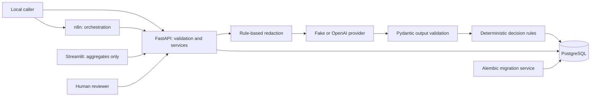

# Architecture

This is a portfolio/educational project using synthetic healthcare data. It demonstrates security-conscious and HIPAA-aware design principles but is not a claim of HIPAA compliance.

## Components and trust boundaries

FastAPI owns validation, persistence, business decisions, reviews and audits. n8n owns transport orchestration, bounded HTTP requests, routing and webhook responses. Streamlit consumes only `/api/v1/analytics/*` and `/ready`, with no DB driver/credentials or raw healthcare fields. The provider abstraction receives only redacted text and structured schemas. It cannot execute application tools directly.

## Backend layout

| Area | Responsibility |
| --- | --- |
| `api/routes` | Thin HTTP adapters and Pydantic contracts |
| `services` | Request transactions, redaction, classification, decision rules, review resolution, analytics |
| `agents` | Single bounded plan, registered tools, execution policy and safe responses |
| `schemas` | Input/output validation, enums, lengths and confidence constraints |
| `models` | SQLAlchemy 2.x request, review and audit models |
| `core` | App/provider/agent configuration, JSON logs, correlation context and HTTP guards |
| `db` | PostgreSQL configuration, pooled sessions, startup retry and migration runner |

## Data and transactions

Requests have an opaque UUID, synthetic input, source/priority, processing status, optional classification/confidence/recommendation/final decision, and timestamps. Human reviews have a unique request FK, state, original recommendation, reviewer outcome/notes and timestamps. Audit events have an optional request FK, controlled type/actor, JSON metadata, correlation UUID and timestamp. Global agent events use run UUID metadata without inventing a request row.

Creation commits a request and REQUEST_RECEIVED together. Processing locks the request and commits decision, optional review and processing audits together. Duplicate completed processing returns the stored result; concurrent processing returns 409. Review resolution locks rows and commits final decision plus completion events; repeat decisions return 409. Agent tools commit separately, with escalation and execution audit in the same transaction. A failed later tool does not roll back earlier committed operations.

`received` means awaiting processing; `processed` means the processing pipeline finished, potentially with a pending human review; `failed` marks unexpected internal processing failure. A provider failure normally leads to processed + HUMAN_REVIEW. The final disposition is `system_decision`, not status alone.

## Runtime

Compose starts PostgreSQL, waits for its health check, runs an advisory-lock-protected Alembic migration service, then starts FastAPI. n8n and Streamlit depend on backend readiness. Migrations run through revision `0005`; no application `create_all()` is used. `/health` checks process liveness and `/ready` checks database/table access, including the correlation column.

Backend, n8n and Streamlit bind published ports to loopback. PostgreSQL is internal unless the optional host-DB override is supplied. Streamlit uses a separate backend network. PostgreSQL and n8n persist in named volumes; `down -v` destroys them. Backend/dashboard images use non-root users and exclude `.env`; no Docker socket is mounted.

## Traceability and analytics

API calls return a generated or validated UUIDv4 X-Correlation-ID. Logs and new audit records retain that ID; the n8n classification workflow carries it from creation into processing. Agent run UUIDs correlate global and request-specific agent events. Neither identifier authenticates a caller or deduplicates intake.

Analytics calculate request cohorts using UTC creation dates/current status and category. Event charts/activity use UTC event dates. Human-approved requests do not count as automated. Read the [metric definitions](operations-dashboard.md#analytics-and-filters) before interpreting rates.

## Deliberate limits

There is no task queue, multi-tenant authorization, clinical decision support or payment execution. Classification is synchronous and holds a DB connection while waiting. The model adapter is an implementation boundary, not an OS sandbox. Historical processing audits are committed together rather than emitted as live progress. See [security](security.md) for remaining exposure and deployment restrictions.
