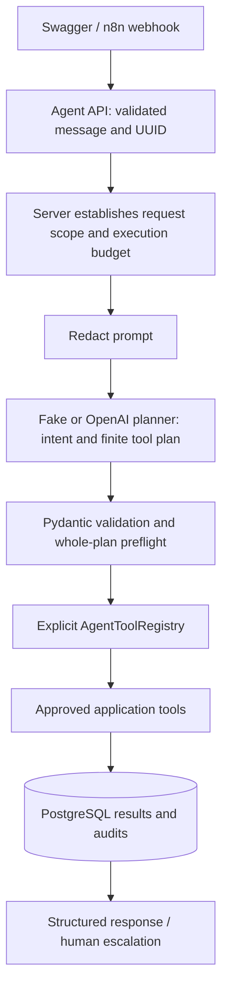

# Phase 6: controlled healthcare operations agent

Synthetic data only. This local portfolio application is not HIPAA compliant. Pattern redaction is incomplete, and the API has no authentication or verified human identities.

## Architecture and boundaries



`HealthcareOperationsAgent` asks for one bounded structured plan, validates it, and executes approved tools. It does not run an open-ended conversational loop. The plan expresses intent and selected operations, not stored chain-of-thought. Tool results are returned directly with fixed service response messages; the LLM cannot fabricate successful execution in the final response. The planner never receives the database session, credentials, raw request records, reviewer notes, or audit metadata.

The real planner uses the configured OpenAI provider, a strict Responses API JSON schema, `store: false`, no retries, and no hosted tools. This follows the [official Structured Outputs documentation](https://developers.openai.com/api/docs/guides/structured-outputs). The application independently validates the plan and every argument. Model-produced tool names are strings looked up in a fixed registry; they are never executable code. The provider adapter has only its fixed OpenAI endpoint and API key. No model-accessible shell, arbitrary SQL/HTTP, filesystem, dynamic Python execution, or approval/rejection capability exists.

The trusted backend tool implementations use SQLAlchemy and normal application database credentials. This is an application capability boundary, not an OS sandbox for the Python process. Never allow model-generated Python, URLs, SQL, or dynamic tool imports into this layer.

## Scope and authorization

The caller can supply `request_uuid` explicitly. Otherwise the server extracts a scope only if the message contains exactly one distinct UUID. Every request-specific tool must match that scope, and the record must exist. Model-selected UUIDs cannot expand access. If explicit `request_uuid` is supplied, it takes precedence over UUIDs in the text. Ambiguous or missing identifiers require clarification/manual action; `REQ-123` is not an existing request identifier format in this project.

These checks limit what the agent can do within one execution. They do **not** establish that a caller owns a request. There is no application authentication in this phase; local callers may select any existing UUID. Before multi-user deployment, derive scope and tool permissions from an authenticated principal and enforce ownership/tenant rules. `AGENT_ALLOW_GLOBAL_COUNT=false` disables the aggregate count capability server-side; the model cannot override it.

## Approved tools

| Tool | Input | Output and limits |
| --- | --- | --- |
| `get_request_status` | `request_uuid` | UUID, processing status, category and system decision; no request text/reference |
| `get_request_history` | `request_uuid` | Latest 50 event names, newest first, plus truncation flag; no audit metadata or notes |
| `get_required_documents` | Category enum | Fixed synthetic checklist, explicitly labeled `synthetic_policy`; not insurer policy or medical advice |
| `create_human_review` | `request_uuid`, reason `USER_REQUESTED`, `UNCERTAIN` or `AGENT_FAILURE` | Pending review ID/status and whether created |
| `get_pending_review_count` | Empty object | Aggregate count, if enabled by server policy |

All input schemas reject unknown fields. Definitions include an effect policy: reads and the specifically named escalation are permitted; any future operation with another effect is rejected with `approval_required`. A future high-impact tool must implement a separate authenticated explicit approval flow before it can be enabled. No such approval tool is registered now.

Creating a review locks the request and reuses an existing pending review. Completed reviews cannot be reopened. A new escalation sets request status `processed`, system decision HUMAN_REVIEW, and a fixed decision reason; existing classification/recommendation is preserved. For an unclassified or failed request, this deliberately sends it to manual handling without running classification again. The tool does not approve/reject a healthcare or billing outcome. Humans use the existing review endpoints.

Review creation and AGENT_TOOL_EXECUTED/HUMAN_REVIEW_REQUESTED audits commit together. If that transaction fails, the review is rolled back. The application returns only committed results. A multi-tool run is not one transaction: earlier successful read/escalation operations can remain committed when a later step fails, and are retained in `results`.

## Limits, failure and audit behavior

- `AGENT_MAX_TOOL_CALLS=5` (1–10): oversized plans are rejected before execution. Automatic fallback escalation uses the same call budget. Each executed attempt consumes a slot; there is no recursive replanning.
- `AGENT_TIMEOUT_SECONDS=25` (0.1–40): a monotonic execution deadline includes planning and tool execution. The async planner is canceled on timeout. Tools check the deadline before execution and before commit and use a PostgreSQL statement timeout capped at three seconds and the remaining budget. There is no detached worker that can later create a review after the API returns.
- This is a deadline for starting/committing application work, not a strict wall-clock HTTP SLA. Connection acquisition, transaction cleanup/commit and required audit writes can add bounded database wait time. The existing DB connection/pool timeouts still apply.
- Unknown tools, malformed arguments, out-of-scope requests, disabled capabilities and completed-review escalation are rejected safely. All planned calls are preflighted before the first execution.
- Malformed plans, provider failure or rejected operations return a structured fallback. When a scoped UUID, time and call budget remain, the same registered escalation tool attempts human review. On an expired deadline no escalation write is attempted.
- `escalated=true` means a pending review was actually returned by the tool. If escalation cannot be created (for example missing UUID, timeout or already resolved review), `escalated=false` and `human_action_required=true` accurately request manual investigation. A fallback is HTTP 200 with `status=fallback`; invalid API inputs are 422, and database unavailability can return 503.

Agent audits are AGENT_STARTED, AGENT_TOOL_REQUESTED, AGENT_TOOL_EXECUTED, AGENT_TOOL_REJECTED, AGENT_FAILED, and AGENT_COMPLETED. A handled failure records AGENT_FAILED then AGENT_COMPLETED with outcome fallback. Unknown names are recorded as `unregistered`; no arbitrary model text is copied. Metadata contains run UUID, registered tool names, controlled reason codes and outcome flags. It excludes prompts, free-text arguments/reasons, provider responses, healthcare text and credentials.

Migration `0004` makes `audit_events.request_id` nullable for global/no-request runs. All agent events correlate through `metadata.run_uuid`; request-specific execution events also reference the request. Use run UUID to inspect the complete sequence. An unavailable database cannot guarantee audit creation; the API does not pretend it can. Audits remain mutable application records. Downgrade refuses while global events exist, preserving history.

## Start and configure

Preserve the existing `.env` password and n8n encryption key. Add/update:

```dotenv
APP_VERSION=0.6.0
AI_PROVIDER=fake
AGENT_MAX_TOOL_CALLS=5
AGENT_TIMEOUT_SECONDS=25
AGENT_ALLOW_GLOBAL_COUNT=true
```

`AI_PROVIDER` selects the provider for both classification and agent planning. Optional real-provider use requires `AI_PROVIDER=openai` and `OPENAI_API_KEY` in ignored `.env`. Existing `OPENAI_MODEL` and `AI_TIMEOUT_SECONDS` apply. Only redacted prompt text is sent externally; regex redaction and `store: false` are not compliance or zero-retention guarantees. Automated tests and live demo verification use the fake provider.

```powershell
docker compose up -d --build --wait --wait-timeout 240
docker compose exec backend python -m alembic -c alembic.ini current
docker compose exec backend python -m alembic -c alembic.ini check
```

Expected migration head: `0004`; backend, PostgreSQL and n8n healthy.

## Swagger demonstration

Open http://127.0.0.1:8000/docs.

1. Use POST `/api/v1/requests` with synthetic data and copy the returned `request_uuid`.
2. Use POST `/api/v1/agent/run` with `{"message":"Check status and history","request_uuid":"<actual UUID>"}`. Expect both read tools in `tools_used`, structured results and `escalated:false`.
3. Run `{"message":"Check status and escalate to human review","request_uuid":"<actual UUID>"}`. Expect `get_request_status`, `create_human_review`, and `escalated:true`.
4. GET `/api/v1/reviews/pending` shows the new review. Repeating the escalation reuses it. Approve/reject manually using the existing review endpoint; the agent cannot reopen that completed review.
5. Run `{"message":"Get pending review count"}` or `{"message":"Get required documents for MISSING_INFORMATION"}` to demonstrate global read tools without a UUID.
6. Run `{"message":"Check request REQ-123"}` to demonstrate a safe fallback requiring a real UUID.

The offline fake planner recognizes these example phrases. It is deterministic demo behavior, not model intelligence or a natural-language security filter. Tests inject malicious names such as `delete_database`, malformed arguments, failing planners and slow responses to exercise enforcement independently of prompts.

Equivalent PowerShell demo:

```powershell
$api = 'http://127.0.0.1:8000/api/v1'
$created = Invoke-RestMethod -Method Post -Uri "$api/requests" -ContentType 'application/json' `
    -Body '{"patient_reference":"PAT-60606","request_text":"Synthetic claim status inquiry for review.","source":"api","priority":"normal"}'
$body = @{message='Check status and history and escalate to human review'; request_uuid=$created.request_uuid} | ConvertTo-Json
$result = Invoke-RestMethod -Method Post -Uri "$api/agent/run" -ContentType 'application/json' -Body $body
$result | ConvertTo-Json -Depth 8
```

## n8n demonstration

Import `n8n/workflows/02_agent_operations.json` into the editor at http://localhost:5678, save and publish **Healthcare Agent Operations**. Or use:

```powershell
docker compose exec n8n n8n import:workflow --input=/workflows/02_agent_operations.json
docker compose exec n8n n8n publish:workflow --id=healthcareAgentOperations02
docker compose restart n8n
```

Wait for n8n readiness, then submit the same `$body` from the API example:

```powershell
Invoke-RestMethod -Method Post -Uri http://127.0.0.1:5678/webhook/healthcare-agent-operations `
    -ContentType 'application/json' -Body $body
```

Flow: webhook → envelope validation → Agent API → response check → IF Escalated → Human Review/Return Result → Audit committed by FastAPI → response. The display branches do not create a duplicate review/audit. FastAPI already committed both. A non-escalated fallback preserves `human_action_required=true`; it is not reported as success. API transport errors are sanitized, retries/redirects disabled, HTTP timeout 45 seconds, workflow timeout 60 seconds. Inspect existing reviews/audits before retrying a lost response. Agent runs themselves are not idempotent; review creation is protected against duplicates.

The test webhook `/webhook-test/healthcare-agent-operations` works only while listening in the editor. Export has no credentials or pinned prompts, and execution saving is disabled. Existing [n8n temporary-storage limitations](n8n-intake.md) still apply.

Reproduce both live branches, verify committed audit events and a pending review, and check invalid-input fallback:

```powershell
.\.venv\Scripts\python.exe n8n/verify_agent.py
```

This script checks the running backend is configured with the fake provider before submission. It leaves one synthetic request and pending review. Host Python dependencies and configured PostgreSQL connection are required.

Inspect agent audit metadata without selecting prompts (replace database/user if customized):

```powershell
docker compose exec postgres psql -U healthcare -d healthcare -c "SELECT event_type, metadata FROM audit_events WHERE event_type LIKE 'AGENT_%' ORDER BY id DESC LIMIT 30;"
```

## Tests and files

```powershell
docker compose --profile test up -d --wait postgres-test
.\.venv\Scripts\python.exe -m pytest -c backend/pytest.ini backend/tests
Get-Content -Raw n8n/test_agent.cjs | docker compose exec -T n8n node
Get-Content -Raw n8n/test_workflow.cjs | docker compose exec -T n8n node
Get-Content -Raw n8n/test_automation.cjs | docker compose exec -T n8n node
docker compose --profile test stop postgres-test
```

New tests cover valid/multiple calls, unknown/forbidden tools, malformed arguments/plans, UUID scope, global permission, call limits, cancellation/provider failure, escalation/duplicates/completed reviews, prompt redaction, safe audits, API input validation, mocked OpenAI transport, atomic rollback when auditing fails, and real database lock timeout with no late review creation. No paid API calls are needed.

| Directory | New files | Modified files |
| --- | --- | --- |
| `backend/app/agents/` | `healthcare_operations.py`, `provider.py`, `tools.py` | — |
| `backend/app/api/routes/` | `agent.py` | — |
| `backend/app/core/` | `agent_config.py` | `config.py` |
| `backend/app/schemas/` | `agent.py` | — |
| `backend/app/models/` | — | `audit_event.py` |
| `backend/app/` | — | `main.py` |
| `backend/alembic/versions/` | `0004_agent_audit_scope.py` | — |
| `backend/tests/` | `test_agent.py` | `conftest.py`, `test_database.py` |
| `n8n/` | `test_agent.cjs`, `verify_agent.py` | — |
| `n8n/workflows/` | `02_agent_operations.json` | — |
| `docs/` | `controlled-agent.md` | — |
| Root | — | `.env.example`, `docker-compose.yml`, `README.md` |

The ignored local `.env` version was updated for the demo. No dependencies were added.
