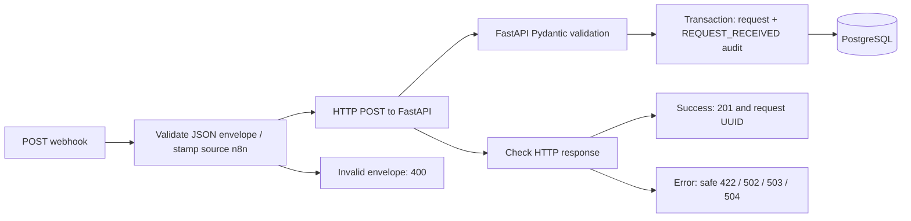

# Phase 4: Healthcare Request Intake

Use only synthetic data. This portfolio environment is not HIPAA compliant and has no application/webhook authentication. All published host ports bind to loopback. n8n's built-in editor account setup remains enabled; do not expose the editor or webhook publicly.

## Architecture



The workflow is named **Healthcare Request Intake**, exported at `n8n/workflows/01_request_intake.json`. It has an explicit success/error branch and Respond to Webhook nodes. The HTTP node uses the fixed internal URL `http://backend:8000/api/v1/requests`; this is Compose DNS, not a credential or a host URL.

n8n only checks that the webhook body is a JSON object and stamps `source: n8n` to identify this entry channel. It forwards all other fields, including unknown fields, unchanged. Required fields, reference format, text length, priority values, whitespace trimming, business rules, persistence, and audit creation belong to FastAPI. The source field is metadata, not proof of an authenticated identity. Audit actor remains `api`, and audit metadata records source `n8n` and the priority.

Alembic revision `0002` extends the request source CHECK constraint from `api` to `api`/`n8n` without rewriting existing data. Downgrading to `0001` is rejected if n8n rows remain; the migration does not silently delete or relabel those records.

## Start n8n

1. Preserve the existing root `.env`. Add `N8N_PORT=5678` and a generated `N8N_ENCRYPTION_KEY`, and update `APP_VERSION=0.4.0`. A key has already been generated in the ignored local `.env` during implementation. For a fresh checkout, generate a key locally and place it in `.env`:

   ```powershell
   python -c "import secrets; print(secrets.token_hex(32))"
   ```

   Keep this key stable with the n8n volume and retain it securely with backups. Do not commit it. `.env.example` intentionally has blank password/key values; Compose refuses to start with missing values.

2. Build and start the stack:

   ```powershell
   docker compose config --quiet
   docker compose up -d --build --wait --wait-timeout 240
   docker compose ps -a
   ```

3. Open **http://localhost:5678** and complete n8n's native owner setup using credentials you keep locally. This is editor access, not new authentication in the healthcare API. No owner account or credentials are bundled in the repository. No n8n license or external account is required for this workflow.

The image is pinned to `docker.n8n.io/n8nio/n8n:2.41.6`. n8n starts after the backend is ready. Its own SQLite database and configuration live in the `n8n_data` volume at `/home/node/.n8n`; it does not receive the application's PostgreSQL credentials. Authoritative request/audit records remain in PostgreSQL; n8n's temporary input retention is described below. Container recreation preserves both volumes; `docker compose down -v` deletes them.

This single-instance local setup uses n8n's bundled JavaScript task runner. The pinned image may report an unused Python runner warning and an internal-runner deprecation warning. The workflow uses only JavaScript; those warnings did not prevent verification. A production deployment would need a separate review, including supported external runner isolation.

## Import and publish

The workflow is already imported and published in the verified local volume. On a fresh instance, use either method below, not both (to avoid duplicate webhook paths).

**Editor:** create/open a workflow, select **Import from File**, choose `n8n/workflows/01_request_intake.json`, save it, and **Publish**. The export is deliberately inactive and contains no credentials or pinned data. No credential assignment is needed for the internal API request.

**CLI:** the workflows directory is mounted read-only at `/workflows`:

```powershell
docker compose exec n8n n8n import:workflow --input=/workflows/01_request_intake.json
docker compose exec n8n n8n publish:workflow --id=healthcareRequestIntake01
```

Use the fixed CLI ID only when importing this file through the CLI. If the editor assigns a new ID, publish from the editor. Re-importing the fixed ID replaces its saved definition; publish again after updates. These commands were verified against the pinned version.

Production URL (requires publishing):

```text
http://localhost:5678/webhook/healthcare-request-intake
```

Test URL (requires clicking **Listen for test event** in the editor first):

```text
http://localhost:5678/webhook-test/healthcare-request-intake
```

The test listener is temporary. Use the production URL for repeatable verification. If you change `N8N_PORT`, update the host URLs; the workflow's internal backend URL remains unchanged.

## Verify the full flow

From the repository root in PowerShell:

```powershell
$payload = Get-Content -Raw sample-data/n8n-request.json
$created = Invoke-RestMethod -Method Post `
    -Uri http://localhost:5678/webhook/healthcare-request-intake `
    -ContentType 'application/json' -Body $payload
$created
Invoke-RestMethod "http://localhost:8000/api/v1/requests/$($created.request_uuid)"
```

The sample contains `PAT-10042`, a fake insurer request, source `n8n`, and priority `high`. Expect webhook HTTP **201**, `persisted: true`, status `received`, category `null`, and a UUID. The GET response should contain the same synthetic fields.

To check the exact database request and audit using the default development user/database:

```powershell
docker compose exec postgres psql -U healthcare -d healthcare -c "SELECT r.request_uuid, r.source, r.priority, a.event_type, a.actor, a.metadata FROM requests r JOIN audit_events a ON a.request_id = r.id WHERE r.request_uuid = '$($created.request_uuid)';"
```

This query prints operational fields, not patient reference/text. Substitute your configured user/database if changed. Expect one `REQUEST_RECEIVED` event with actor `api` and metadata `{"source":"n8n","priority":"high"}`.

For repeatable verification using the host virtual environment:

```powershell
.\.venv\Scripts\python.exe n8n/verify_intake.py
```

The script calls the published webhook, checks the actual request/audit rows, and verifies invalid inputs create no additional rows. It deliberately leaves one new synthetic request/audit pair per run. Run it against this local portfolio database when no other writes are occurring, because it compares row counts. It never prints database credentials or patient fields.

## Error behavior

| Situation | Webhook response | Owner of validation |
| --- | --- | --- |
| Valid request committed | 201 with UUID | FastAPI/PostgreSQL |
| Body is not a JSON object | 400 | n8n transport-envelope check |
| Short text, invalid priority, unknown fields | 422 with safe field/error codes | FastAPI |
| Backend reports database failure | 503 | FastAPI |
| Cannot connect to backend or unexpected backend response | 502 | n8n HTTP/response handling |
| Backend HTTP request exceeds 10 seconds | 504 | n8n timeout handling |

Malformed JSON may be rejected by n8n's HTTP parser before the workflow runs. The HTTP node disables redirects, captures status/body for non-2xx responses, and routes connection errors through the same safe response logic. The overall workflow timeout is 30 seconds. No raw HTTP exception, upstream headers, or submitted values are returned by error branches.

**There are no automatic POST retries.** A timeout/connection loss can occur after the database commits, so a retry can create a duplicate. n8n failure does not prove the request was never stored. Idempotency is a future phase.

Test validation by changing `priority` to `urgent` or `request_text` to `short`; expect 422. To test a transport outage, stop `backend`, submit the sample, expect 502, then restore it:

```powershell
docker compose stop backend
# Submit the webhook sample; expect HTTP 502.
docker compose up -d --wait --wait-timeout 180 backend
```

Stopping PostgreSQL while leaving the backend running should instead produce 503. Restore it with `docker compose up -d --wait postgres`. Failed inputs/outage checks should not create request/audit pairs; a timeout has an uncertain outcome.

## Privacy, logs, and exporting

- No secrets, credentials, or pinned execution inputs are in the workflow JSON. The committed sample is synthetic.
- Execution saving is disabled for success, error, manual runs, and node progress both in instance configuration and workflow settings. **This is not zero storage:** the pinned n8n version temporarily persists in-flight input, then soft-deletes completed runs. Hard deletion is configured with no age buffer and a one-minute sweep interval. Temporary payloads can remain until a sweep runs, and stopped instances cannot prune. n8n may retain operational metadata and SQLite free pages/backups; this is not a secure-erasure guarantee. The editor can also display live synthetic input. Do not pin data or use real healthcare data.
- Diagnostics, personalization, version notifications, templates, and community packages are disabled. Environment access from workflow expressions/Code nodes is blocked. n8n receives its encryption key, not application DB credentials.
- n8n logs warnings/errors to the console. Backend request logs contain route templates/status/timing, not request bodies. Use `docker compose logs --tail 30 n8n backend`; do not enable verbose payload logging.
- The encryption key protects n8n credential encryption; it does not make all workflow data encrypted at rest or make this deployment HIPAA compliant. Local HTTP cookie settings are only for the loopback development environment.

The checked-in workflow was exported from the verified running instance, with deployment-specific history/owner data removed and `active` reset to false. To export a future edit:

```powershell
docker compose exec n8n n8n export:workflow --id=healthcareRequestIntake01 --output=/tmp/intake.json
docker compose cp n8n:/tmp/intake.json ./n8n/intake-export.local.json
```

The raw export is ignored by Git. Before replacing the committed JSON, keep the workflow definition only, remove runtime/version history and owner metadata, clear `pinData`, remove credential bindings, and set `active: false`. The CLI export is an array; the portable file is one workflow object.

Configuration references: [n8n execution retention](https://docs.n8n.io/deploy/host-n8n/configure-n8n/basic-configuration/use-environment-variables/executions.md), [n8n security variables](https://docs.n8n.io/deploy/host-n8n/configure-n8n/basic-configuration/use-environment-variables/security.md).

## Tests

```powershell
docker compose --profile test up -d --wait postgres-test
.\.venv\Scripts\python.exe -m pytest -c backend/pytest.ini backend/tests
Get-Content -Raw n8n/test_workflow.cjs | docker compose exec -T n8n node
.\.venv\Scripts\python.exe n8n/verify_intake.py
docker compose --profile test stop postgres-test
```

On macOS/Linux use `.venv/bin/python` and `docker compose exec -T n8n node < n8n/test_workflow.cjs`. Backend tests use isolated schemas in the dedicated test database. Workflow JavaScript checks exercise the exported normalization/error code, including timeout handling. The final verification uses the real published webhook and application database.
