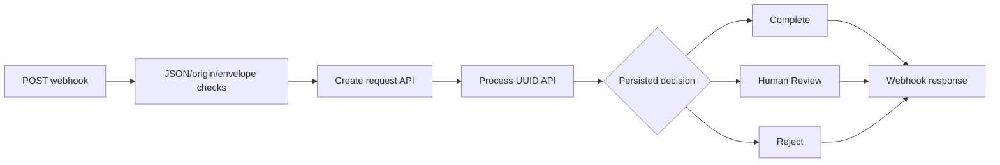

# n8n workflow catalog

The exports contain no credentials, keys or pinned request data. FastAPI owns business rules/persistence; n8n orchestrates calls and reports the committed response. All examples use synthetic data.

| Export | Name / webhook path | Purpose |
| --- | --- | --- |
| `01_request_intake.json` | Healthcare Request Intake / `healthcare-request-intake` | Historical create-only flow; HTTP 201 |
| `01_healthcare_request_automation.json` | Healthcare Request Automation / `healthcare-request-automation` | Create → process → AUTO_PROCESS/HUMAN_REVIEW/REJECT; HTTP 200 |
| `02_agent_operations.json` | Healthcare Agent Operations / `healthcare-agent-operations` | Agent API → escalation/result branch; HTTP 200, including explicit fallback |



Human Review/Complete/Reject and Audit committed by FastAPI are display/routing nodes. They do not duplicate database state changes or audit writes. The API has already committed them. Do not add parallel business rules into Code nodes.

## Import and publish

Start Compose, open http://localhost:5678, complete native owner setup, then use Import from File and Publish for each desired workflow. Editor login does not authenticate the public webhook route. Alternatively:

```powershell
docker compose exec n8n n8n import:workflow --input=/workflows/01_request_intake.json
docker compose exec n8n n8n publish:workflow --id=healthcareRequestIntake01
docker compose exec n8n n8n import:workflow --input=/workflows/01_healthcare_request_automation.json
docker compose exec n8n n8n publish:workflow --id=healthcareRequestAutomation01
docker compose exec n8n n8n import:workflow --input=/workflows/02_agent_operations.json
docker compose exec n8n n8n publish:workflow --id=healthcareAgentOperations02
docker compose restart n8n
```

Wait for health/readiness after restarting. Re-import updates a workflow with the exported ID; preserve any local custom edits first. Exports are deliberately inactive. Production URLs use `/webhook/<path>` after publishing; `/webhook-test/<path>` works only while Listen for test event is active.

## HTTP and security behavior

HTTP nodes address `http://backend:8000` through Docker DNS. Creation timeout is 10 seconds; processing/agent timeout is 45 seconds; overall workflow timeout is 60 seconds. Redirects and automatic POST retries are disabled. Validation failures are reported safely without submitted values. If processing fails after creation, the existing UUID is returned so an operator can inspect it instead of duplicating intake.

Requests require `Content-Type: application/json`; non-loopback browser Origin headers are rejected. The instance payload cap is 1 MiB; FastAPI independently caps bodies at 64 KiB. These are local-demo protections, not webhook authentication. Do not expose port 5678 publicly without authenticated/signed webhooks and TLS.

The API generates/validates an opaque correlation UUID; the workflow returns it and forwards creation's ID into processing. Agent run UUIDs provide an additional audit grouping key. Invalid envelopes rejected before the API have no backend audit.

Execution success/error/manual saving and progress persistence are disabled. n8n may still persist in-flight inputs before pruning and SQLite may retain remnants; this is not zero storage/secure deletion. Do not pin real data or export execution history. The JS Code runner is for trusted workflow authors. Environment access/community packages and command/file nodes are disabled; n8n is not granted an application LLM key or DB password.

## Demo and tests

Run [the final demo](demo.md) for both classification and controlled-agent workflows. Run all exported JavaScript tests with:

```powershell
Get-Content -Raw n8n/test_workflow.cjs | docker compose exec -T n8n node
Get-Content -Raw n8n/test_automation.cjs | docker compose exec -T n8n node
Get-Content -Raw n8n/test_agent.cjs | docker compose exec -T n8n node
Get-Content -Raw n8n/test_monitoring.cjs | docker compose exec -T n8n node
Get-Content -Raw n8n/test_security.cjs | docker compose exec -T n8n node
```
